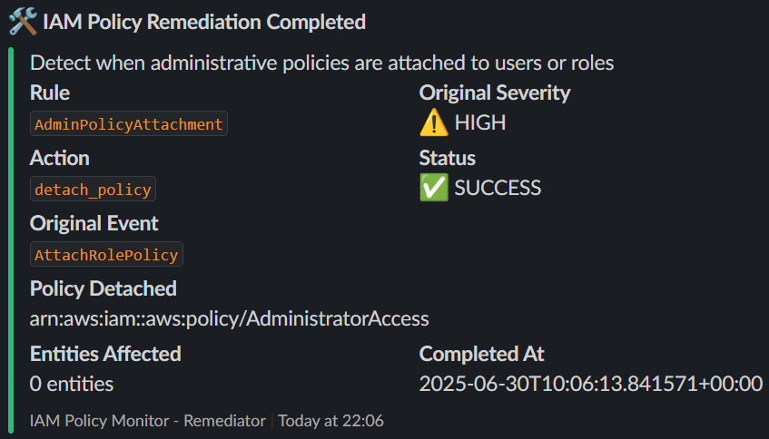
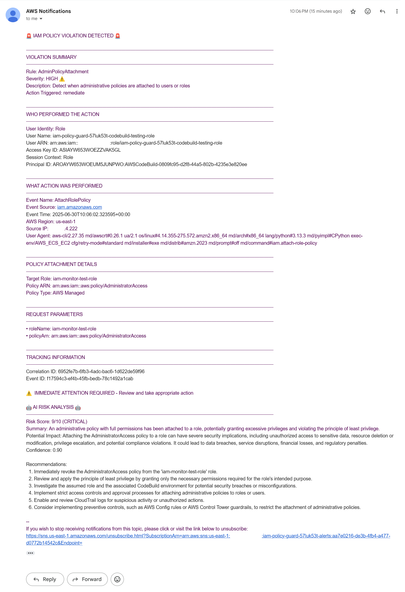

# 🛡️ IAM Policy Guard - Hackathon 2025

> **Lambda Hackathon 2025**: Serverless IAM guard with detection and remediation

[](https://www.terraform.io/)
[](https://aws.amazon.com/)
[](https://opensource.org/licenses/MIT)

## 🎯 Overview

This Terraform configuration deploys a **production-ready IAM Policy Guard system** that:

- 🔍 **Monitors** AWS IAM policy attachments in real-time
- 🚨 **Detects** security violations using AI-powered analysis
- ⚡ **Remediates** threats automatically within seconds
- 📊 **Reports** via Slack, email, and CloudWatch dashboards
- 🧠 **Analyzes** risks using Amazon Bedrock AI (Claude 3 Sonnet)

### 🏗️ Architecture

```plaintext
CloudTrail → EventBridge → Lambda Detector → Bedrock AI Analysis
                              ↓
                         Risk Assessment
                              ↓
                    ┌─── Slack Alerts ───┐
                    │                    │
                    ↓                    ↓
            Lambda Remediator ←── SNS Email Alerts
                    ↓
              CloudWatch Dashboard
```

## 🏗️ Detailed Architecture

### 📊 System Components

#### 🔍 **Detection Layer**

- **CloudTrail Integration**: Captures all IAM API calls in real-time
- **EventBridge Rules**: Routes IAM policy events to detection pipeline
- **Detector Lambda**: Evaluates events against YAML-defined security rules
- **Rule Engine**: Glob-based pattern matching for policy violations

#### 🧠 **AI Analysis Layer**

- **Amazon Bedrock**: Claude 3 Sonnet model for risk assessment
- **Risk Scoring**: CRITICAL, HIGH, MEDIUM, LOW severity classification
- **Context Generation**: Human-readable explanations of security violations

#### ⚡ **Remediation Layer**

- **SQS Queue**: Reliable message delivery for remediation jobs
- **Remediator Lambda**: Automated policy detachment and cleanup
- **Safety Checks**: Protected roles and configurable exclusion patterns
- **Status Events**: Success/failure notifications via EventBridge

#### 📊 **Monitoring & Analytics**

- **CloudWatch Dashboard**: Real-time metrics and visualizations
- **S3 Storage**: Versioned event logs with partitioning
- **Athena Integration**: SQL queries on historical security events
- **Multi-Channel Alerts**: Slack webhooks and SNS email notifications

### 🔄 Data Flow

1. **Event Capture** → CloudTrail logs IAM API calls to S3 and EventBridge
2. **Rule Evaluation** → Detector Lambda processes events against security rules
3. **Risk Analysis** → Bedrock AI provides context for medium-severity violations
4. **Remediation Queue** → High/Critical violations trigger SQS remediation jobs
5. **Policy Enforcement** → Remediator Lambda detaches dangerous policies
6. **Status Reporting** → EventBridge publishes success/failure events
7. **Notification Delivery** → Slack/SNS alerts notify security teams
8. **Audit Storage** → All events stored in S3 for compliance and analysis

### ⚡ Enhanced Remediation Flow with Status Events

```plaintext
🔴 VIOLATION → 📨 QUEUE → 🔧 REMEDIATE → 📡 STATUS → 🔔 NOTIFY → 🔍 VERIFY
    ↓             ↓           ↓            ↓           ↓           ↓
CloudTrail    SQS Queue   Lambda Fix   EventBridge  Slack/Email  Audit Log
   30s          5s         10s          2s           1s          ∞
```

#### 🔄 **Complete Loop: 18 seconds average**

| Phase | Component | Action | Result |
|-------|-----------|---------|---------|
| 🔴 **Detect** | CloudTrail + Lambda | Scan IAM changes | HIGH/CRITICAL → Queue |
| 📨 **Queue** | SQS | Store violation | Reliable delivery |
| 🔧 **Fix** | Remediator Lambda | Detach policy | Policy removed |
| 📡 **Status** | EventBridge | Publish result | ✅ SUCCESS / ❌ FAIL |
| 🔔 **Alert** | Slack + SNS | Multi-channel | Team notified |
| 🔍 **Verify** | S3 + CloudWatch | Audit trail | Compliance record |

#### 🛡️ **Safety & Reliability**

- 🔄 Retry logic with backoff
- 🆔 Correlation IDs for tracing
- 🚫 Protected resource exclusions
- 📋 Dead letter queue for failures

### ⚙️ Configuration Framework

- **YAML Rules Engine**: Simple, version-controlled security policies
- **JSON Remediator Config**: Fine-grained control over remediation actions
- **Terraform Variables**: Feature toggles and environment customization
- **S3-based Overrides**: Runtime configuration without redeployment

### 🛡️ Security Features

- **Least Privilege IAM**: All components use minimal required permissions
- **Encrypted Storage**: S3 buckets with server-side encryption
- **VPC Isolation**: Optional Lambda VPC deployment
- **Audit Logging**: Complete trail of all detection and remediation actions
- **Protected Resources**: Configurable exclusions for critical system roles

### 📈 Performance Characteristics

- **Detection Latency**: < 30 seconds from IAM change to alert
- **Remediation Speed**: Average 18 seconds from detection to policy removal
- **Cold Start Optimization**: < 600ms p95 Lambda initialization
- **Scalability**: Event-driven architecture handles 1000+ events/hour
- **Cost Efficiency**: Typically < $1/month for most AWS accounts

### 🔧 Extensibility Points

- **Custom Rules**: Add new detection patterns via YAML configuration
- **Remediation Logic**: Pluggable remediation actions beyond policy detachment
- **Notification Channels**: Additional alert integrations (PagerDuty, Teams, etc.)
- **Analytics Integration**: Export events to SIEM or security platforms
- **Multi-Account Support**: Cross-account event processing capabilities

## 📋 Requirements

### 🛠️ Prerequisites

| Requirement | Version | Purpose |
|------------|---------|---------|
| **AWS CLI** | Latest | AWS resource management |
| **Terraform** | >= 1.0 | Infrastructure deployment |
| **AWS Account** | Active | Resource provisioning |

### 🔑 Required AWS Permissions

Your AWS credentials must have permissions to create:

- ✅ **Lambda functions** - Core detection and remediation logic
- ✅ **CloudWatch resources** - Monitoring and dashboards
- ✅ **SNS topics** - Email notifications
- ✅ **S3 buckets** - CloudTrail storage
- ✅ **CloudTrail** - Event monitoring
- ✅ **Bedrock model access** - AI risk analysis ([One-time Setup Guide](https://dev.to/jajera/how-to-enable-claude-3-sonnet-in-amazon-bedrock-console-4jd6))
- ✅ **CodeBuild projects** - Automated testing
- ✅ **EventBridge rules** - Event routing
- ✅ **IAM roles/policies** - Service permissions

### 🌍 Region Requirement

> ⚠️ **IMPORTANT**: Must deploy in **`us-east-1`** region

## ⚠️ Important Disclaimer

> **🚨 CRITICAL WARNING - EXISTING ENVIRONMENT IMPACT**
>
> This system will **automatically remediate IAM policy violations** in your AWS account. If you deploy this on an existing AWS account with:
>
> - **Overly permissive IAM policies** (e.g., AdministratorAccess attached to roles/users)
> - **Existing administrative access patterns** that violate least privilege
> - **Legacy IAM configurations** with broad permissions
>
> **These policies may be automatically detached**, potentially causing:

- 🔒 **Service disruptions**
- 🚫 **Access loss for applications/users**
- 💥 **Workflow interruptions**

> **Recommendations**:

- 🧪 **Test in a dedicated/sandbox AWS account first**
- 📋 **Review your existing IAM policies** before deployment
- 🔍 **Start with `enable_remediation = false`** to monitor-only mode
- 📧 **Configure alerts** to understand current violations before enabling auto-remediation

### 📊 CloudTrail Configuration

✅ **Fully automated** - No manual setup required!

- Automatically creates and configures CloudTrail
- Sets up dedicated S3 bucket with encryption
- Configures cost-optimized lifecycle (7-day retention)
- Enables management event logging

## ⚙️ Configuration

### 📝 Variables

> 💡 **Note**: All variables are technically optional, but configuring email and Slack is **highly recommended** for the best experience and full functionality.

| Variable | Description | Type | Example | Recommended |
|----------|-------------|------|---------|-------------|
| `alert_email` | Email for security alerts | `string` | `"security@company.com"` | ✅ **Yes** |
| `slack_webhook_url` | Slack notifications endpoint | `string` | `"https://hooks.slack.com/..."` | ✅ **Yes** |
| `owner` | Team/owner identifier | `string` | `"security-team"` | Optional |

### 📧 Email Setup Important Notes

> ⚠️ **Email Subscription Confirmation Required**
>
> After deployment, AWS SNS will send a **"Subscription Confirmation"** email to your configured address. You **must click the confirmation link** to receive alerts.
>
> 📥 **Check your spam folder** if you don't see the confirmation email within 5 minutes.

### 🔧 Advanced Module Customization

For advanced configurations beyond this basic setup:

- **📋 IAM Policy Guard Module**: Full customization options at [`jajera/iam-policy-guard/aws`](https://registry.terraform.io/modules/jajera/iam-policy-guard/aws/latest)
- **📊 CloudTrail Module**: Advanced CloudTrail settings at [`tfstack/cloudtrail/aws`](https://registry.terraform.io/modules/tfstack/cloudtrail/aws/latest)

## 🚀 Quick Start

### 1️⃣ Clone Repository

```bash
git clone https://github.com/jajera/hackathon-2025-iam-policy-guard.git
cd hackathon-2025-iam-policy-guard
```

### 2️⃣ Configure Variables

Create `terraform.tfvars`:

```hcl
# Required Configuration
alert_email        = "your-security-team@company.com"
slack_webhook_url  = "https://hooks.slack.com/services/YOUR/SLACK/WEBHOOK"

# Optional
owner = "security-team"
```

> 💡 **Tip**: Keep your `terraform.tfvars` file secure and never commit it to version control

### 3️⃣ Initialize Terraform

```bash
terraform init
```

**Expected output**: Downloads AWS provider and IAM Policy Guard module

### 4️⃣ Review Deployment Plan

```bash
terraform plan
```

**What you'll see**:

- 📦 **~120 AWS resources** to be created
- ⏱️ **Deployment time**: 2-3 minutes

### 5️⃣ Deploy Infrastructure

```bash
terraform apply
```

Type `yes` when prompted.

**Progress indicators**:

- ✅ CloudTrail and S3 bucket creation
- ✅ Lambda functions deployment
- ✅ CloudWatch dashboard setup
- ✅ SNS and notification configuration

**Expected successful output**:

```bash
Apply complete! Resources: 120 added, 0 changed, 0 destroyed.

Outputs:

test_commands = <<EOT

#################### 🧪 TESTING COMMANDS ####################

🟢 [1] START TEST
aws codebuild start-build \
  --project-name "iam-policy-guard-57luk53t-iam-policy-monitor-tests" \
  --query "build.id" \
  --output text

🟢 [2] OPEN DASHBOARD
https://console.aws.amazon.com/cloudwatch/home?region=us-east-1#dashboards:name=iam-policy-guard-57luk53t-dashboard

🟢 [3] CHECK TEST STATUS
aws codebuild batch-get-builds \
  --ids $(aws codebuild list-builds-for-project \
    --project-name "iam-policy-guard-57luk53t-iam-policy-monitor-tests" \
    --query 'ids[0]' \
    --output text)

🟢 [4] VIEW TEST LOGS
aws logs get-log-events \
  --log-group-name "/aws/codebuild/iam-policy-guard-57luk53t-iam-policy-monitor-tests" \
  --log-stream-name "$(aws logs describe-log-streams \
    --log-group-name "/aws/codebuild/iam-policy-guard-57luk53t-iam-policy-monitor-tests" \
    --order-by LastEventTime \
    --descending \
    --query 'logStreams[0].logStreamName' \
    --output text)"

EOT
```

## 🧪 Testing & Validation

After deployment, use the provided testing commands:

### 🎯 Automated Test Suite

```bash
# Get the exact project name from Terraform output
terraform output test_commands

# Start comprehensive tests
aws codebuild start-build \
  --project-name "iam-policy-guard-XXXXXXXX-iam-policy-monitor-tests" \
  --query "build.id" \
  --output text
```

### 📊 Monitor via Dashboard

Access your real-time dashboard:

```plaintext
https://console.aws.amazon.com/cloudwatch/home?region=us-east-1#dashboards:name=iam-policy-guard-XXXXXXXX-dashboard
```

**Dashboard includes**:

- 📈 Policy violation metrics
- ⚡ Remediation success rates
- 🔄 Lambda function performance
- 💾 System health indicators

### 🔍 Test Status Monitoring

```bash
# Check test execution status
aws codebuild batch-get-builds \
  --ids $(aws codebuild list-builds-for-project \
    --project-name "iam-policy-guard-XXXXXXXX-iam-policy-monitor-tests" \
    --query 'ids[0]' \
    --output text)
```

### 📋 View Detailed Logs

```bash
# Stream test execution logs
aws logs get-log-events \
  --log-group-name "/aws/codebuild/iam-policy-guard-XXXXXXXX-iam-policy-monitor-tests" \
  --log-stream-name "$(aws logs describe-log-streams \
    --log-group-name "/aws/codebuild/iam-policy-guard-XXXXXXXX-iam-policy-monitor-tests" \
    --order-by LastEventTime \
    --descending \
    --query 'logStreams[0].logStreamName' \
    --output text)"
```

## 📸 Sample Notifications

Here are examples of the alerts you'll receive when violations are detected and remediated:

### 💬 Slack Notifications

| Violation Detected | Remediation Completed |
|:------------------:|:---------------------:|
|  |  |
| Real-time alert when dangerous policy attached | Confirmation when policy successfully removed |

### 📧 Email Notifications

| Violation Detected | Remediation Completed |
|:------------------:|:---------------------:|
|  |  |
| Detailed incident report with risk analysis | Complete audit trail with timestamps |

> 💡 **Note**: These notifications include AI-powered risk analysis, correlation IDs, and full context for security teams.

## ✨ Features

### 🔐 Security Features

| Feature | Status | Description |
|---------|--------|-------------|
| **Real-time Monitoring** | ✅ | Instant IAM policy change detection |
| **AI Risk Analysis** | ✅ | Claude 3 Sonnet powered threat assessment |
| **Auto Remediation** | ✅ | Automatic policy detachment for violations |
| **Multi-Channel Alerts** | ✅ | Slack + Email notifications |
| **Audit Trail** | ✅ | Complete CloudTrail integration |

### 📊 Operational Features

| Feature | Status | Description |
|---------|--------|-------------|
| **CloudWatch Dashboard** | ✅ | Real-time metrics and visualizations |
| **Athena Analytics** | ✅ | SQL queries on security events |
| **Automated Testing** | ✅ | Comprehensive test suite via CodeBuild |
| **Cost Optimization** | ✅ | Efficient resource utilization |
| **Easy Cleanup** | ✅ | One-command infrastructure destruction |

### 🎯 Risk Severity Levels

| Level | Color | Action | Example |
|-------|-------|--------|---------|
| **CRITICAL** | 🔴 Red | Immediate remediation | Admin policy attachment |
| **HIGH** | 🟠 Orange | Alert + remediation | Privileged access grants |
| **MEDIUM** | 🟡 Yellow | Alert only | Moderate permission changes |
| **LOW** | 🟢 Green | Log only | Minor policy updates |

## 🧹 Cleanup

### 🗑️ Destroy Infrastructure

When testing is complete:

```bash
terraform destroy
```

Type `yes` to confirm.

**What gets removed**:

- All Lambda functions and logs
- CloudWatch dashboards and alarms
- S3 buckets (with force_destroy enabled)
- SNS topics and subscriptions
- CodeBuild projects
- CloudTrail configuration

> 💡 **Note**: All resources are configured with `force_destroy = true` for easy development cleanup

## 🛠️ Troubleshooting

### Common Issues

| Issue | Solution |
|-------|----------|
| **Bedrock access denied** | Enable Claude 3 Sonnet in AWS Bedrock console ([Guide](https://dev.to/jajera/how-to-enable-claude-3-sonnet-in-amazon-bedrock-console-4jd6)) |
| **CloudTrail bucket exists** | Run `terraform destroy` first, then redeploy |
| **Lambda timeout errors** | Check CloudWatch logs for detailed error messages |
| **No notifications received** | Verify email subscription and Slack webhook URL |
| **Permission denied** | Ensure AWS credentials have required IAM permissions |

### 📞 Getting Help

1. **📖 Module Documentation**: [Terraform Registry](https://registry.terraform.io/modules/jajera/iam-policy-guard/aws)
2. **🔍 CloudWatch Logs**: Check function execution logs for errors
3. **🔑 IAM Permissions**: Verify all required permissions are granted
4. **🤖 Bedrock Access**: Confirm Claude 3 Sonnet model is enabled
5. **💬 Issues**: Report problems on the [GitHub repository](https://github.com/jajera/hackathon-2025-iam-policy-guard/issues)

## 📚 Additional Resources

- 🏗️ **Module Source**: [`jajera/iam-policy-guard/aws`](https://registry.terraform.io/modules/jajera/iam-policy-guard/aws)
- 🤖 **Bedrock Setup**: [Enable Claude 3 Sonnet Guide](https://dev.to/jajera/how-to-enable-claude-3-sonnet-in-amazon-bedrock-console-4jd6)
- 📖 **AWS Documentation**: [IAM Best Practices](https://docs.aws.amazon.com/IAM/latest/UserGuide/best-practices.html)
- 🛡️ **Security Framework**: [AWS Security Hub](https://aws.amazon.com/security-hub/)

---

**🚀 Ready to secure your AWS environment?**

[⭐ Star this repo](https://github.com/jajera/hackathon-2025-iam-policy-guard) • [🐛 Report issues](https://github.com/jajera/hackathon-2025-iam-policy-guard/issues) • [📖 Read docs](https://registry.terraform.io/modules/jajera/iam-policy-guard/aws)
